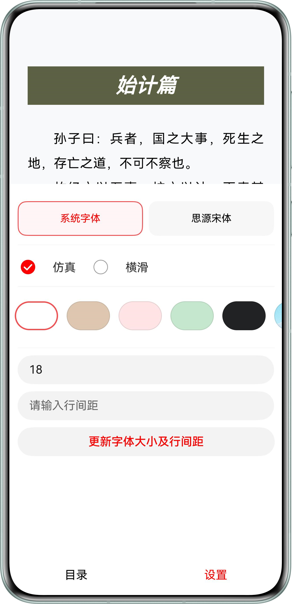

# 使用Reader Kit进行电子书阅读
## 介绍
基于Reader Kit（阅读服务）提供的能力，实现了电子书的阅读功能。为开发者展示了多种格式电子书的解析、排版、阅读交互能力，以及如何借助Reader Kit的能力和组件快速构建书籍阅读能力。

## 效果预览
| **首页（初始状态）**                            | **首页（导入书籍后状态）**                              | **阅读页**                                |
|-----------------------------------------|----------------------------------------------|-----------------------------------------|
|  |  |  | 

| **目录页**                            | **设置页）**                           |
|-----------------------------------------|-----------------------------------------|
|  |  |

### 本示例工程使用说明

1. 运行本示例，开发者需要先将txt、epub、mobi、azw、azw3格式的书籍文件下载到SD卡目录。
2. 运行本示例，开发者需要先去[下载](https://github.com/adobe-fonts/source-han-serif/tree/release?tab=readme-ov-file)“思源宋体”文件，并放到“rawfile\fonts”目录。
3. 运行项目成功后，开发者先通过“导入书籍”按钮将书籍文件导入到应用沙箱目录，然后再点击“去阅读器”按钮跳转到阅读页阅读书籍。
4. 在阅读页，开发者可左右横滑进行翻页。也可点击屏幕中间弹出菜单栏，在菜单栏可点击“目录”按钮跳转到目录页查看书籍目录列表，也可点击“设置”按钮跳转到设置页更改阅读设置项。
5. 在目录列表页，将会按目录层级展示书籍的目录列表。开发者可以上下滑动进行查看书籍目录，也可点击目录列表项跳转到对应章节进行阅读。
6. 在设置页，开发者可更改字体、翻页方式、背景色或背景图片、字体大小以及行间距。

## 工程目录
````
├──entry/src/main/ets	            // 代码区
│  ├──common
│  │  ├──BookParserInfo.ets         // 导入书的信息
│  │  ├──FontFileInfo.ets           // 字体信息
│  │  └──LocalBookImporter.ets      // 本地书籍导入工具类
│  ├──entryability
│  │  ├──EntryAbility.ets           // 程序入口类
│  │  └──WindowAbility.ets          // 窗口管理类
│  ├──entrybackupability
│  │  └──EntryBackupAbility.ets     // 备份入口类  
│  ├──pages        
│  │  ├──Index.ets                  // 页面入口，用于导入书籍
│  │  └──Reader.ets                 // 阅读页
│  └──utils
│     ├──BookUtils.ets              // 书籍工具类
│     └──FileUtils.ets              // 文件操作工具类
└──entry/src/main/resources/rawfile // 应用资源目录
   ├──dark_sky_first.jpg            // 自定义背景图片-暗色
   └──white_sky_first.jpg           // 自定义背景图片-浅色
````
## 具体实现
首页导入书籍及跳转阅读页，请参考Index.ets：
* 导入书籍通过picker.DocumentViewPicker进行实现，通过documentSelectOptions.fileSuffixFilters属性可过滤支持阅读的书籍文件。
* 导入书籍后，通过fileIo将书籍文件copy到应用沙箱目录，通过点击“去阅读器”按钮，可将应用沙箱目录的书籍路径传到阅读页进行阅读。
* 首页会通过@StorageLink装饰器监听“当前阅读页排版数据”的变化，如果该值不为空则显示“继续阅读”按钮，点击跳转时会将进度信息传到阅读页继续阅读。
* 首页会通过@StorageLink装饰器监听“文本缩放因子”是否变化，如果因[智慧多窗](https://developer.huawei.com/consumer/cn/doc/harmonyos-guides/multi-window-intro)等场景变化时，则会重启“阅读页”重新进行内容排版。

构建阅读页，请参考Reader.ets：
* 在build()方法中添加阅读内容展示、交互场景化组件ReadPageComponent，并初始化所需的组件控制器及默认设置项。
* 在aboutToAppear()方法中获取Index页面传入的书籍文件路径及进度信息，初始化书籍解析器，以及通过startPlay()方法渲染阅读器页面。
* 通过在EntryAbility监听onConfigurationUpdate()方法，实时保存当前colorMode，如果检测到变化则切换到对应的主题。
* 通过display.on('change')方法监听“文本缩放因子”的变化，如果变化则重启阅读页。
* 通过readerComponentController.on('pageShow')接口监听页面展示回调，回调会返回页面排版信息。通过AppStorage保存页面排版信息，并通知Index页面刷新页面。
* 通过WindowAbility监听窗口大小的变化，当PAD横竖屏切换、折叠屏展开与折叠，智慧多窗等场景时，将会实时更新页面可视窗口大小，保证页面排版的正常。

展示目录列表，请参考Reader.ets：
* 通过书籍解析器可获取目录节点列表，通过目录层级信息，可按层级展示目录列表。 同时也会获取书籍信息，用于书名及书封等信息的展示。
* 当点击目录列表项时，通过书籍解析器的getDomPosByCatalogHref()及getSpineList()接口，可获取跳转至点击目录所对应的进度信息，通过startPlay()方法可阅读对应目录的内容。

更改阅读设置，请参考Reader.ets：
* 通过将自定义字体、背景图片的资源文件放到工程rawfile或应用沙箱目录，调用ReadPageComponent组件控制器的setPageConfig()方法，并实现资源请求回调将对应资源的ArrayBuffer返回，可切换成自定义字体及背景图片。
* 通过更改设置项的flipMode属性，并调用ReadPageComponent组件控制器的setPageConfig()方法，可实时切换成“仿真”及“横滑”翻页。
* 通过更改设置项的fontSize及lineHeight属性，并调用ReadPageComponent组件控制器的setPageConfig()方法，可实时更改字体大小及行高。

## 约束与限制

* 本示例仅支持标准系统上运行，支持设备：华为手机、平板、PC/2in1设备。

* 本示例为Stage模型，支持API 16。

* HarmonyOS系统：HarmonyOS 5.0.4 Release及以上。

* DevEco Studio版本：DevEco Studio 5.0.4 Release及以上。

* HarmonyOS SDK版本：HarmonyOS 5.0.4 Release SDK及以上。


