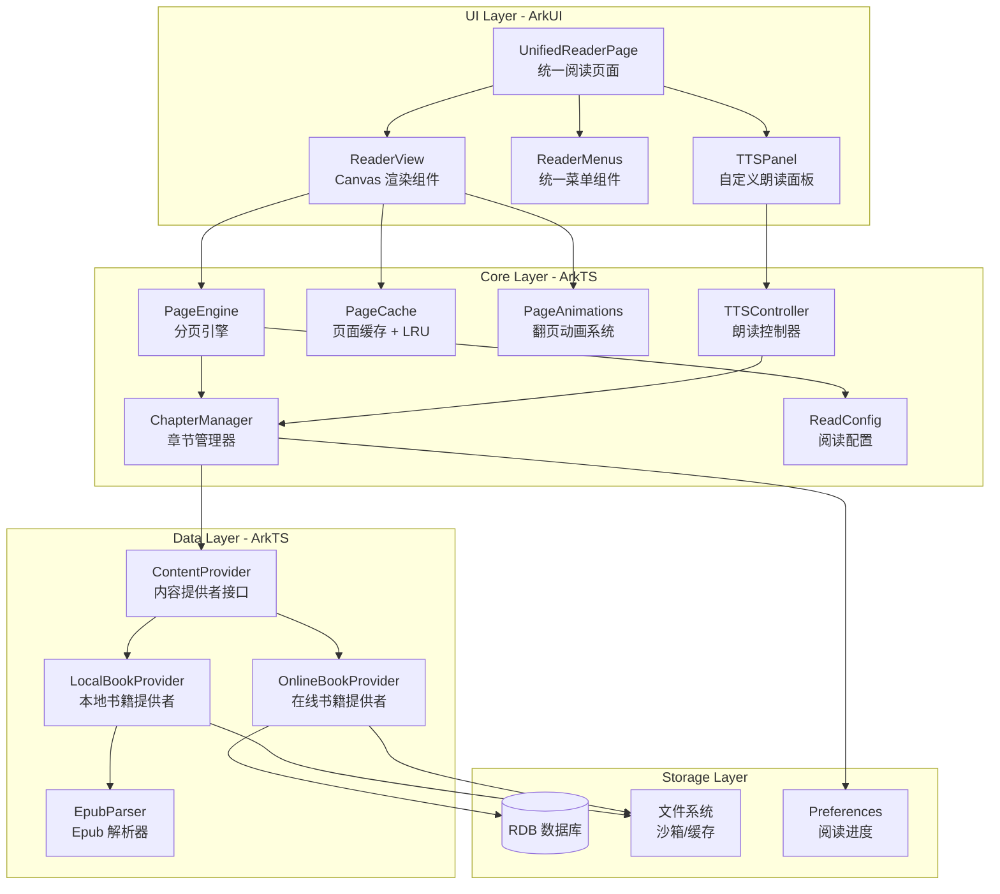
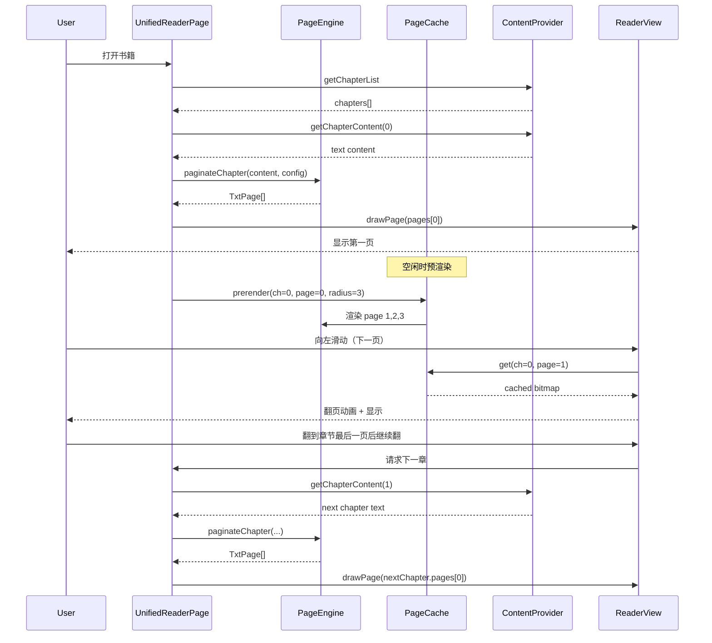

# 鸿蒙端自研阅读器引擎架构规划

## 一、现状分析

### 1.1 当前双阅读器问题

| 维度 | Reader.ets（本地书籍） | OnlineChapterReader.ets（在线书籍） |
|------|----------------------|-----------------------------------|
| 渲染方式 | ReaderKit ReadPageComponent（系统黑盒） | Scroll + Text 组件（原生滚动） |
| 翻页模式 | 仿真翻页、滑动翻页 | 仅滚动 |
| 分页能力 | 系统自动分页 | 无分页 |
| 格式支持 | epub | 纯文本 |
| 朗读方式 | TextReader（系统面板，不可自定义封面） | TextReader（同上） |
| 代码量 | 1617 行 | 888 行 |
| UI 菜单 | 自建菜单（目录/字体/主题/翻页） | 复刻了类似菜单 |

**核心矛盾**：两套完全独立的渲染管线，UI 风格虽然尝试统一但交互体验差异明显，代码大量重复。

### 1.2 已有自研阅读器骨架（reader 目录）

项目中 `entry/src/main/ets/reader/` 已经有一套自研阅读器的骨架代码，但**尚未集成到主流程**：

- `PageLoader.ets` — 文本分页引擎（字符级宽度计算 + 分页）
- `ReaderView.ets` — Canvas 绘制组件（支持手势翻页）
- `ReadConfig.ets` — 阅读配置单例（字号/行距/主题/翻页模式）
- `PageAnimation.ets` — 翻页动画抽象类
- 5 种动画实现：仿真/覆盖/滑动/滚动/无动画
- `BookModels.ets` — TxtChar/TxtLine/TxtPage 数据模型
- `ChapterManager.ets` — 章节管理器

### 1.3 SDL Demo 的参考价值

`reader_sdl_cached.c` 提供了以下可借鉴的思路：

- **页面纹理缓存 + LRU 驱逐**：避免重复渲染，翻页时直接取缓存
- **预渲染队列**：主循环空闲时渐进预渲染相邻页面
- **epub 解析流程**：container.xml → OPF → manifest/spine → 章节内容

---

## 二、架构目标

1. **统一阅读体验**：本地书籍和在线书籍使用同一个阅读器组件
2. **完全可控的 UI**：自定义朗读面板（可替换封面）、自定义菜单、自定义高亮
3. **高性能分页**：大文件快速分页，翻页流畅不卡顿
4. **可扩展格式**：txt、epub，未来可扩展 pdf
5. **复用已有代码**：基于 reader 目录的骨架代码进行增强，而非从零开始

---

## 三、整体架构



---

## 四、核心模块设计

### 4.1 ContentProvider — 内容提供者接口

统一本地和在线书籍的内容获取方式，这是消除双阅读器的关键抽象。

```typescript
// 内容提供者接口
interface ContentProvider {
  // 获取章节列表
  getChapterList(): Promise<ChapterInfo[]>
  // 获取指定章节的纯文本内容
  getChapterContent(chapterIndex: number): Promise<string>
  // 获取书籍元信息
  getBookInfo(): BookMeta
  // 获取封面图片
  getCoverImage(): Promise<PixelMap | null>
}

// 书籍元信息
interface BookMeta {
  title: string
  author: string
  coverUrl: string
  format: 'txt' | 'epub' | 'online'
  totalChapters: number
}
```

**LocalBookProvider**：
- epub 格式：使用自研 EpubParser 解析 container.xml → OPF → spine → 提取章节纯文本
- txt 格式：使用正则匹配章节标题进行分章（复用现有 `is_heading_line` 逻辑）

**OnlineBookProvider**：
- 复用现有 `BookSourceParser` + `OnlineBookDataManager`
- 优先从本地缓存读取，缓存未命中时从网络获取

### 4.2 PageEngine — 分页引擎（增强版）

基于现有 `PageLoader.ets` 进行增强：

**现有问题**：
- 字符宽度使用固定比例估算（中文=fontSize，英文=fontSize*0.6），不够精确
- 没有段落间距处理
- 没有首行缩进
- 没有页面缓存机制

**增强方案**：

```typescript
class PageEngine {
  // 使用 Canvas measureText 进行精确文字测量
  private measureContext: CanvasRenderingContext2D

  // 核心分页方法
  paginateChapter(content: string, config: ReadConfig): TxtPage[]

  // 精确字符宽度测量（替代固定比例）
  private measureCharWidth(char: string): number {
    return this.measureContext.measureText(char).width
  }

  // 支持段落间距和首行缩进
  private wrapParagraph(text: string, isFirstLine: boolean): string[]

  // 页面缓存：chapter+config hash → TxtPage[]
  private pageCache: Map<string, TxtPage[]>
}
```

**关键改进**：
1. 使用 `CanvasRenderingContext2D.measureText()` 替代固定比例，精确测量每个字符宽度
2. 支持段落间距（`paragraphSpacing`）
3. 支持首行缩进（2个全角空格）
4. 分页结果缓存：相同章节+相同配置不重复分页

### 4.3 PageCache — 页面渲染缓存

借鉴 SDL Demo 的 LRU 缓存思路，但适配 ArkUI Canvas：

```typescript
class PageCache {
  private cache: Map<string, ImageBitmap>  // key: chapter_page
  private accessOrder: string[]            // LRU 访问顺序
  private maxSize: number = 20             // 最大缓存页数

  // 获取已渲染的页面位图
  get(chapterIndex: number, pageIndex: number): ImageBitmap | null

  // 缓存渲染结果
  put(chapterIndex: number, pageIndex: number, bitmap: ImageBitmap): void

  // LRU 驱逐
  private evictIfNeeded(): void

  // 预渲染相邻页面（在主线程空闲时调用）
  prerender(currentChapter: number, currentPage: number, radius: number): void

  // 配置变更时清空缓存
  invalidateAll(): void

  // 章节切换时清除旧章节缓存
  invalidateChapter(chapterIndex: number): void
}
```

**注意**：HarmonyOS ArkUI 的 Canvas 不支持 OffscreenCanvas，预渲染需要在主线程通过 `requestAnimationFrame` 渐进执行，每帧渲染一页，避免阻塞 UI。

### 4.4 ReaderView — 统一渲染组件（增强版）

基于现有 `ReaderView.ets` 增强：

```
现有能力：Canvas 绘制 + 手势翻页 + 页眉页脚
需要增强：
├── 页面缓存集成（优先从缓存取位图）
├── 翻页动画系统集成（5种动画）
├── 朗读高亮绘制（当前朗读段落绿色背景）
├── 搜索高亮绘制（搜索关键词黄色背景）
├── 选中文本支持（长按选词）
└── 章节边界自动切换（翻到最后一页后自动加载下一章）
```

### 4.5 TTSController — 自定义朗读控制器

放弃 TextReader 系统面板，使用 TTS 引擎 + 自定义 UI：

```typescript
class TTSController {
  private ttsEngine: textToSpeech.TextToSpeechEngine | null

  // 朗读控制
  start(paragraphs: string[], startIndex: number): void
  pause(): void
  resume(): void
  stop(): void

  // 进度回调
  onParagraphStart: (index: number) => void
  onParagraphEnd: (index: number) => void

  // 速度/音量控制
  setSpeed(speed: number): void
  setVolume(volume: number): void
}
```

**自定义朗读面板 TTSPanel**：
- 可自定义封面图片（解决原始问题）
- 显示当前朗读段落
- 播放/暂停/上一段/下一段控制
- 速度调节、定时关闭
- 浮动小控制条模式（不遮挡阅读内容）

### 4.6 EpubParser — 自研 Epub 解析器

替代 ReaderKit 的 `bookParser`，纯 ArkTS 实现：

```typescript
class EpubParser {
  // 解析 epub 文件（zip 格式）
  async parse(filePath: string): Promise<EpubBook>

  // 内部流程：
  // 1. 使用 zlib 解压 epub（zip 格式）
  // 2. 解析 META-INF/container.xml 获取 OPF 路径
  // 3. 解析 OPF 获取 manifest + spine
  // 4. 按 spine 顺序提取章节 xhtml
  // 5. 从 xhtml 中提取纯文本（strip HTML tags + 处理实体）
  // 6. 提取封面图片
}

interface EpubBook {
  metadata: BookMeta
  chapters: EpubChapter[]
  coverImage: ArrayBuffer | null
}

interface EpubChapter {
  title: string
  content: string  // 纯文本
  href: string
}
```

**关键技术点**：
- HarmonyOS 提供 `@ohos.zlib` 模块可以解压 zip 文件
- HTML 实体处理：`&amp;` → `&`，`&lt;` → `<`，`&#x...;` → 对应字符
- 段落提取：`<p>` 标签 → 换行分隔，`<br>` → 换行
- 标题提取：`<title>` 标签或 `<h1>`-`<h6>` 标签

---

## 五、统一阅读页面设计

### 5.1 UnifiedReaderPage — 统一入口

替代现有的 `Reader.ets` 和 `OnlineChapterReader.ets`：

```
UnifiedReaderPage
├── 路由参数
│   ├── source: 'local' | 'online'
│   ├── filePath?: string          // 本地书籍路径
│   ├── bookId?: number            // 在线书籍ID
│   ├── chapterIndex?: number      // 起始章节
│   └── chapters?: ChapterInfo[]   // 在线章节列表
│
├── 初始化流程
│   ├── 根据 source 创建对应的 ContentProvider
│   ├── 获取章节列表
│   ├── 加载起始章节内容
│   ├── 分页 → 渲染第一页
│   └── 预渲染相邻页面
│
├── UI 结构
│   ├── ReaderView（全屏 Canvas）
│   ├── 顶部状态栏（章节标题）
│   ├── 底部状态栏（时间/电量/页码）
│   ├── ReaderMenus（底部菜单面板）
│   └── TTSPanel（朗读浮动控制条）
│
└── 生命周期
    ├── aboutToAppear → 初始化
    ├── onPageHide → 保存进度
    └── aboutToDisappear → 释放资源
```

### 5.2 菜单系统

复用现有菜单设计，统一为独立组件：

```
ReaderMenus
├── 目录面板（Tab 0）— 章节列表 + 当前高亮
├── 字体面板（Tab 1）— 字号滑块 + 行距滑块 + 字体选择
├── 主题面板（Tab 2）— 7种主题色 + 背景图
├── 翻页面板（Tab 3）— 5种翻页模式
└── 进度条 — 章节进度滑块 + 上/下一章
```

---

## 六、数据流架构



---

## 七、迁移策略

### 阶段一：核心引擎完善

- 增强 `PageLoader.ets`：精确文字测量、段落间距、首行缩进
- 实现 `PageCache`：LRU 缓存 + 预渲染
- 实现 `ContentProvider` 接口 + `OnlineBookProvider`
- 增强 `ReaderView.ets`：集成缓存、动画系统

### 阶段二：Epub 解析器

- 实现 `EpubParser`：zlib 解压 + OPF 解析 + HTML 文本提取
- 实现 `LocalBookProvider`：epub + txt 格式支持
- 验证与 ReaderKit 的解析结果一致性

### 阶段三：统一阅读页面

- 创建 `UnifiedReaderPage`：统一路由入口
- 抽取菜单为独立组件 `ReaderMenus`
- 集成章节切换、进度保存、书签功能
- 路由迁移：将 `Reader.ets` 和 `OnlineChapterReader.ets` 的入口指向新页面

### 阶段四：自定义朗读

- 实现 `TTSController`：基于 `textToSpeech` 引擎
- 实现 `TTSPanel`：自定义朗读面板（可设置封面）
- 实现朗读文本内联高亮
- 移除对 `TextReader`（SpeechKit）的依赖

### 阶段五：优化与打磨

- 仿真翻页动画优化（贝塞尔曲线翻页效果）
- 大文件性能优化（懒加载章节、分页结果持久化）
- 长按选词、复制文本
- 搜索高亮
- 夜间模式平滑切换

---

## 八、文件结构规划

```
entry/src/main/ets/
├── reader/                          # 自研阅读器引擎
│   ├── core/
│   │   ├── PageEngine.ets           # 分页引擎（增强版 PageLoader）
│   │   ├── PageCache.ets            # 页面渲染缓存 + LRU
│   │   ├── ChapterManager.ets       # 章节管理器（已有，增强）
│   │   └── TextMeasurer.ets         # 精确文字测量工具
│   ├── components/
│   │   ├── ReaderView.ets           # Canvas 渲染组件（已有，增强）
│   │   ├── ReaderMenus.ets          # 统一菜单组件（从 Reader.ets 抽取）
│   │   └── TTSPanel.ets             # 自定义朗读面板
│   ├── animations/
│   │   ├── PageAnimation.ets        # 翻页动画基类（已有）
│   │   ├── SimulationPageAnim.ets   # 仿真翻页（已有）
│   │   ├── CoverPageAnim.ets        # 覆盖翻页（已有）
│   │   ├── SlidePageAnim.ets        # 滑动翻页（已有）
│   │   ├── ScrollPageAnim.ets       # 滚动翻页（已有）
│   │   ├── NonePageAnim.ets         # 无动画（已有）
│   │   └── PageAnimFactory.ets      # 动画工厂（已有）
│   ├── config/
│   │   └── ReadConfig.ets           # 阅读配置（已有）
│   ├── models/
│   │   └── BookModels.ets           # 数据模型（已有）
│   ├── providers/
│   │   ├── ContentProvider.ets      # 内容提供者接口
│   │   ├── LocalBookProvider.ets    # 本地书籍提供者
│   │   ├── OnlineBookProvider.ets   # 在线书籍提供者
│   │   └── EpubParser.ets          # Epub 解析器
│   └── tts/
│       └── TTSController.ets        # TTS 朗读控制器
├── pages/
│   ├── UnifiedReaderPage.ets        # 统一阅读页面（新建）
│   ├── Reader.ets                   # 旧本地阅读器（迁移后废弃）
│   └── OnlineChapterReader.ets      # 旧在线阅读器（迁移后废弃）
```

---

## 九、技术风险与应对

| 风险 | 影响 | 应对方案 |
|------|------|---------|
| Canvas 性能不足 | 大页面绘制卡顿 | 页面缓存 + 预渲染；必要时用 XComponent + Native 绘制 |
| 自研 epub 解析不完整 | 部分 epub 显示异常 | 渐进式支持，先覆盖主流格式；保留 ReaderKit 作为降级方案 |
| 文字测量精度 | 分页不准确 | 使用 Canvas measureText 实测；建立字符宽度缓存 |
| 仿真翻页效果 | 效果不如 ReaderKit | 参考开源实现（如 Android PageFlip），用贝塞尔曲线模拟 |
| zlib 解压 epub | API 兼容性 | HarmonyOS 提供 @ohos.zlib，需验证对 epub 的支持 |

---

## 十、与 SDL Demo 的对应关系

| SDL Demo 模块 | 鸿蒙自研对应 | 说明 |
|---------------|-------------|------|
| layout_text_to_lines | PageEngine.wrapText | 文本排版分行 |
| paginate_lines_to_pages | PageEngine.paginateChapter | 行分页 |
| CachePool + LRU | PageCache | 页面缓存 |
| preload queue | PageCache.prerender | 预渲染队列 |
| render_page_to_texture | ReaderView.drawPage | 页面渲染 |
| parse_epub_simple | EpubParser | epub 解析 |
| parse_txt_chapters | LocalBookProvider | txt 分章 |
| SDL_Renderer | CanvasRenderingContext2D | 绘制后端 |
| SDL_Texture | ImageBitmap / 缓存 Canvas | 渲染缓存 |
